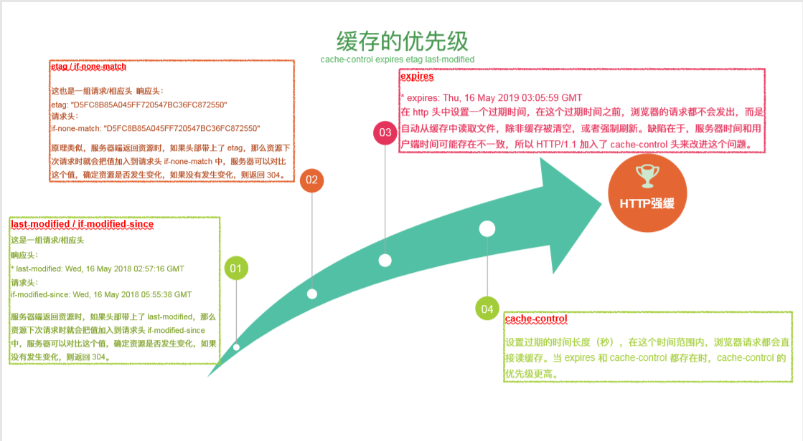
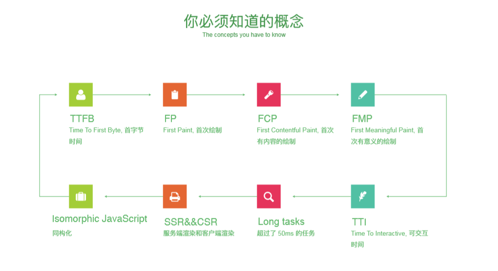

# 前端架构与性能优化那些事儿

## 性能优化学徒工
    雅虎军规
    离线缓存
      前端ORM存储方案
      localForage
    缓存得优先级
      4、cache-control 用合适的Cache-ControlHTTP头来让浏览器进行条件性的请求
      3、expires 对于静态组件：通过设置一个遥远的将来时间作为Expires来实现永不失效
      2、etac  是服务器和浏览器用来决定浏览器缓存中组件与源服务器中的组件是否匹配的一种机制
      1、last-modified

    网站协议
    小字为先
## 渲染中性能优化 

    重绘影响
    如何规避
    重排影响
    高效渲染

## 页面加载性能优化
    FP FCP FMP TTI

    
## NodeJS性能优化
  内存回收
  内存快照
  压力测试
  监控异常
