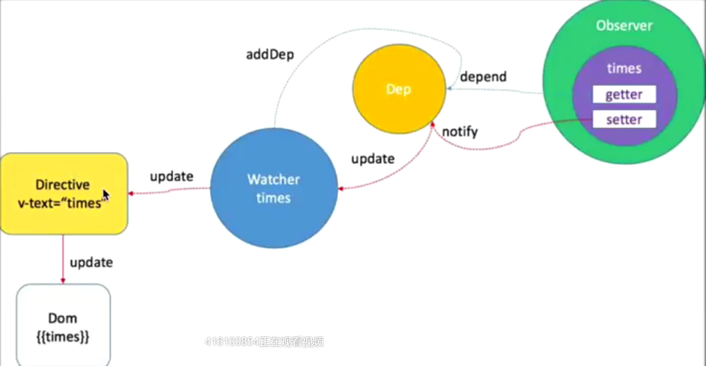
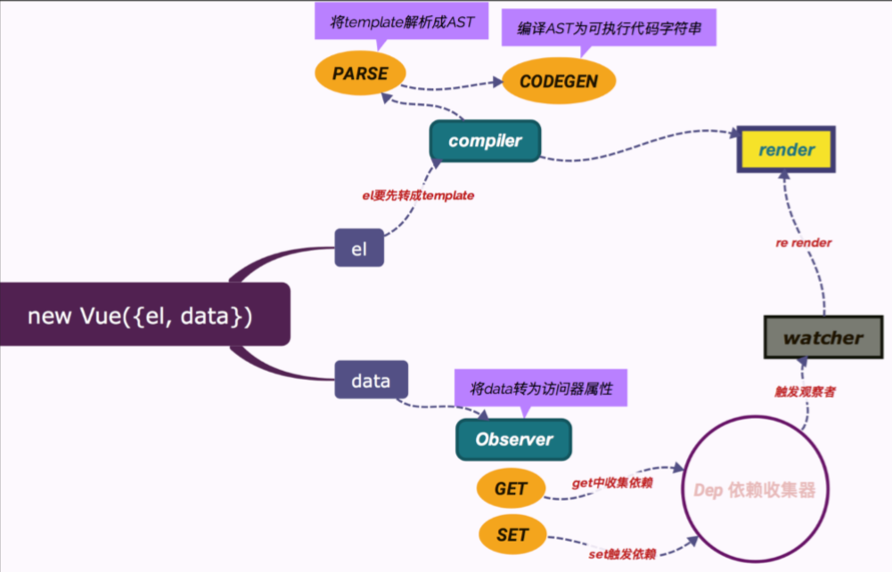
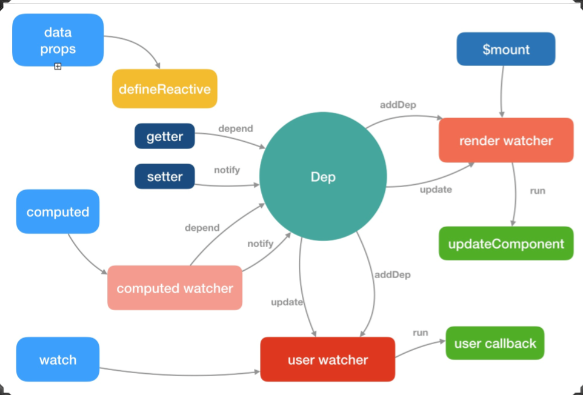
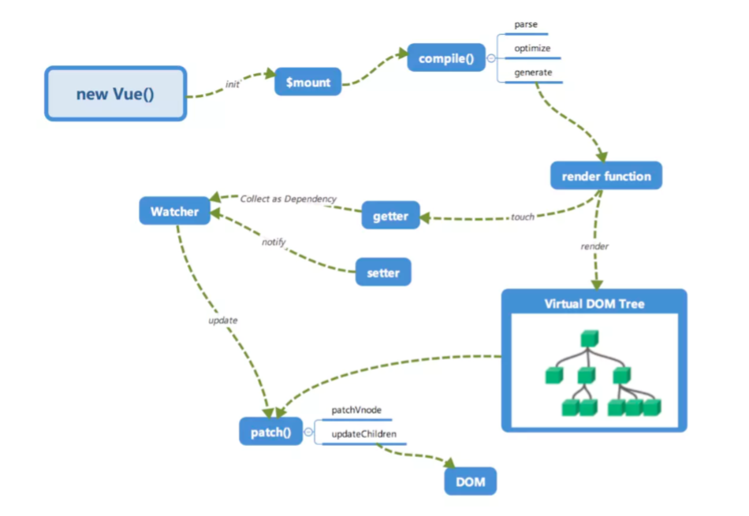

# Vue源码

## Vue架构概览
    1./compiler 目录是编译模板
    2./core目录是Vue.js的核心(也是后面的重点)
    3./entries 目录是生产打包的入口
    4./platforms 目录是针对核心模块的'平台模块'
    5.platforms下暂时只有web目录
    6./server 目录是处理服务端渲染
    7./sfc目录处理单文件 .vue
    8./shared目录提供全局用到的工具函数

    Vue.js的组成是由core + 对应的'平台'补充代码构成(独立构建和运行时构建只是platforms下web平台的两种选择)
    
    Vue.js的目标是通过尽可能简单的API实现响应的数据绑定和组合的视图组件
    1. compents 模板编译的代码
    2. global-api 最上层的文件接口
    3. instance 生命周期 -> init.js
    4. observer 数据收集与订阅
    5. util 常用工具方法类
    6. vdom虚拟dom
    
    Vue2.0在保持实现'响应的数据绑定'的同时又引入了'virtual-dom', 那么它是怎么实现的呢?

    -----------------------------------------------

    双向数据绑定(响应式原理)所设计到的技术
    1.Object.defineProperty
    2.Observe
    3.Watcher
    4.Dep
    5.Directive

    -------------------------------------------------
    var obj = {}
    var a;
    Object.defineProperty(obj, 'a', {
      get: function() {
        console.log("get val")
        return a
      },
      set: function(newVal) {
        console.log("set val" + newVal);
        a = newVal;
      }
    });
    obj.a //get val  ---------> {{a}}
    obj.a = '111' // set val 111-----------> <input v-model="a">

    太低版本不支持Vue  因为不支持 Object.defineProperty

    san.js 
    __defineGetter__
    __defineSetter__
    vbscript 微软以前引入了class  get set

    setter触发消息到Watcher, Watcher帮忙告诉Directive更新DOM,DOM中修改了数据也会通知Watcher, Wathcer帮忙修改数据

    -------------------------------------------------

    Observer
      观察者模式是软件设计模式的一种。在此模式中,一个目标对象管理所有相依于它的观察者对象,并且在它本身的状态改变时主动发出通知
      订阅者模式设计三个对象: 发布者、主题对象、订阅者,三个对象间的是一对多的关系, 每当主题对象状态发生改变时, 其相依赖的对象都会得到通知, 并被自动更新
      (function($){
        var o = $({})
        $.subscribe = funciton() {
          o.on.apply(o, arguments)
        }
        $.unsubscribe = function() {
           o.off.apply(o, arguments)
        }
        $.publish = function() {
          o.trigger.apply(o, arguments)
        }
      })(jQuery)
    
    ------------------------------------
    1. vm data -> {
      text: "Hello World"
    }
    寻找observe对象

    2. defineReactive(vm, key, obj[key])
    把当前你写的data里的值统统的给挂到了vm实例上
        vm text 'Hello World'
    3.Dep ?? -> Dep.target
    4. Compile 元素包裹父节点 vm
    5.new Watcher(vm, node, name, 'nodeValue')

    -----------------------------------
    同步执行栈
    异步队列   EventLoop 浏览器端
        宏任务                  微任务
        macrotask          microtask
        settimeout          promise.then
        event                   observer
        ajax                      message
        postmessage
      微任务再前  宏任务再后

    观察者是什么? 复制将事件分类
      idle观察者 process.nextTick()
      IO观察者  类似 setTimeout()
      check观察者 setImmediate()

    --------------------
    vue里面, 有时候变量层级太深,修改变量不会生效
    arrayMethods 切割

    ------------------------------
    vue3   proxy

    -------------------------------------
    Observer
      function Dep() { //主题对象
        this.subs = []; // 订阅者列表
      }
      //主题对象通知订阅者
      Dep.prototype.notify = function() {
        //遍历所有的订阅者, 执行订阅者提供的更新方法
        this.subs.forEach(function(sub) {
          sub.update();
        });
      }
      function Sub(x) { //订阅者
        this.x = x;
      }
      //订阅者更新
      Sub.prototype.update = function() {
        this.x = this.x + 1;
        console.log(this.x)
      }

      var pub = {
        publish:function() {
          dep.notify();
        }
      };
      var dep = new Dep(); //主题对象实例
      dep.subs.push(new Sub(1), new Sub(2));
      //新增两个订阅者
      pub.publish()//发布者发布更新

      src/core/observer/index.js
      src/core/observer/array.js

      Observer会观察两种类型的数据, Object和Array
      对于Array类型的数据   当数组发生变化时,触发notify
      如果时push、unshift、splice这些添加新元素的操作,则会使用observer观察新添加的数据
      重写完原型方法后,遍历拿到数据中的每个数据 使用observer观察它

      而对于Object的类型,则遍历它的每个key, 使用defineProperty设置getter和setter, 当触发getter的时候,observer则开始收集依赖, 而触发setter的时候, observe则触发notify

       constructor (value: any) {
        this.value = value
        //一个Dep对象实例, Watcher和Observer之间的纽带
        this.dep = new Dep()
        this.vmCount = 0
        //把自身this添加到value的_ob_属性上
        def(value, '__ob__', this)
        //对value的类型进行判断
        if (Array.isArray(value)) {
          //数组增强方法
          if (hasProto) {
            protoAugment(value, arrayMethods)
          } else {
            copyAugment(value, arrayMethods, arrayKeys)
          }
          //如果是数组则观察数组
          this.observeArray(value)
        } else {
          this.walk(value) // 是否观察单个元素
        }
      }

      observeArray就是对数组进行遍历,递归调用observe方法, 最终都会走入walk方法监控单个元素

      export function defineReactive (

      ) {
        //每一个对象都会有Dep实例, 用来保存依赖(Wather对象)
        const dep = new Dep()
        let childOb = !shallow && observe(val)
        //最重点、基石、核心的部分:
        //给data的每个属性都添加getter和setter方法
        Object.defineProperty(obj, key, {
          enumerable: true,
          configurable: true,
          get: function reactiveGetter () {
            const value = getter ? getter.call(obj) : val

            if (Dep.target) {
              dep.depend() // 依赖收集
              if (childOb) {
                childOb.dep.depend()
                if (Array.isArray(value)) {
                  dependArray(value)
                }
              }
            }
            return value
          },
          set: function reactiveSetter (newVal) {
            const value = getter ? getter.call(obj) : val
            ......
            childOb = !shallow && observe(newVal)
            dep.notify() //通知dep进行数据更新
          }
        })
      }
    --------------------------------

    Watcher
      src/core/observer/Watcher.js
      Watcher是将模板和Observer对象结合再一起的纽带。
      Watcher是订阅者模式中的订阅者。Watcher的两个参数:
      expOrFn最终会被转换为getter函数,cb是更新时执行的回调。依赖收集的入口就是get函数

      this.vm = vm
      //将当前的Watcher类推送到对应的Vue实例中
      vm._watchers.push(this)
      if (typeof expOrFn === 'function') {
        //如果是函数,相当于指定了当前订阅者获取数据的方法,每次订阅通过这个方法获取数据然后与之前的值进行对比
        this.getter = expOrFn
      } else {
        this.getter = parsePath(expOrFn) //否则的话将表达式解析为可执行的函数
      }
      //如果lazy不为true, 则执行get函数进行依赖收集
      this.value = this.lazy? undefined: this.get()

    ------------------------------------------------
    watch: {
      msg() {
        this.msg = Math.random()
      }
    }

    ------------------------------------------------
    Directive
      Vue内置了这么多指令,这些指令都会抛出两个接口bind和update
      this._directives.push({
        new Directive(descreiptor, this, node, host, scope,frag)
      })
      1.所有tag为true的数据中的扩展对象拿出来一个Directive实例并添加到_directives中(_directives是当前vm中存储directive实例的地方)
      2.调用所有已绑定的指令的bind方法
      3.实例化一个Watcher,将指令的update与watcher绑定在一起
      4.调用指令的update,首次初始化视图
      5.这里有一个点需要注意以下,实例化Watcher的时候,Watcher会将自己主动的推入Dep依赖中
    ------------------------------

  -------------------------------------------------
    Vue SetState
      简单的说就是在要执行的函数中用事务包裹起来,在函数执行前加入initialize阶段,函数执行,最后执行close阶段,
      那么Batch Update中在事件的initialize阶段,一个update queue被创建。在事件中调用setState方法时,状态不会被立即调用,而是被push进Update queue中

  ----------------------------------------------------
    Virtual-Dom
      core/vdom/cteate-element.js
      DOM操作慢是两个原因,一个是本身操作就不快,第二个是我们(还有很多框架)处理dom的方式很慢

      'Virtual-dom'是一系列模块的集合,用来提供声明式的DOM渲染, 在js和dom之间做了一个缓存

    Compiler
      AST -> 虚拟dom

      compiler -> optimizer -> codegen -> vdom -> dom diff -> patch

## Vue2

    Vue2整体流程解析
    src/core/instance/init.js  生命周期源码

    initLifecycle(vm)//vm的生命周期相关变量初始化
    initEvents(vm) // vm的事件监控初始化
    initRender(vm) // 模板解析变量初始化
    callHook(vm, 'beforeCreate')
    //vm 的状态初始化 
    initState(vm)
    callHook(vm, 'created')
    if(vm.$options.el) {
      vm.$mount($.options.el) //模板编译入口
    }

    Html Parser将模板解析成可直接执行的render函数, 这事模板预编译和服务端渲染(SSR)的前提：

    export function initState (vm: Component) {
      vm._watchers = []
      const opts = vm.$options
      //初始化Props, 与initDate差不多
      if (opts.props) initProps(vm, opts.props)
      //初始化Methods
      if (opts.methods) initMethods(vm, opts.methods)
      if (opts.data) {
        initData(vm) //初始化Data
      } else {
        observe(vm._data = {}, true /* asRootData */)
      }
      //初始化computed, 这部分会涉及到Watcher类以及依赖收集
      if (opts.computed) initComputed(vm, opts.computed)
      if (opts.watch && opts.watch !== nativeWatch) {
        initWatch(vm, opts.watch)
      }
    }

