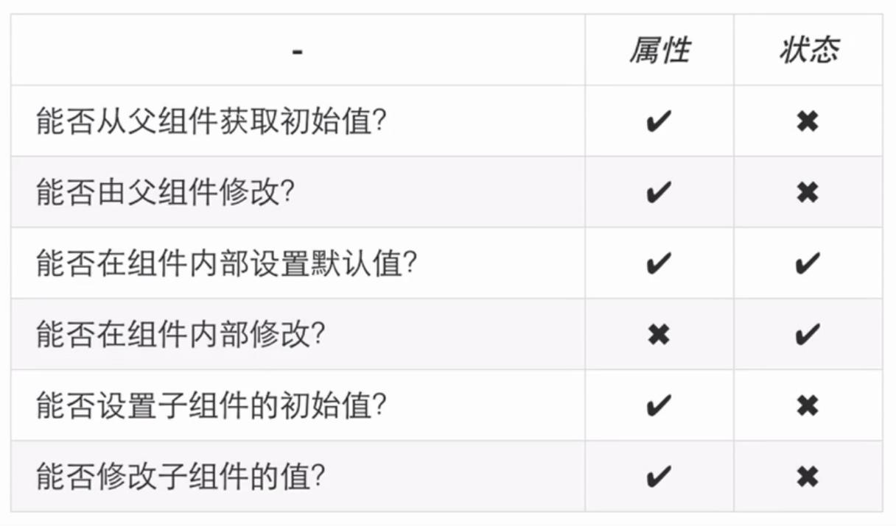

## React

## JSX介绍与使用
  

## 非DOM属性介绍

## 也许答案不是DOM

## 属性
    getDefaultProps: function() {
      return {
        name: '123
      }
    },
    propTypes: {
      name: this.React.propTypes.string //属性校验
    }

    render:function() {
      return (
        
Hello, {this.props.name}

      )
    }

## 状态的介绍和应用
    state
    状态是由事务自行处理、不断变化的
    对于React来讲一切变化全部基于状态

    setState -> diff算法  -> 有变化 更新

    getInitialState:funciton() {
      return {
        isLoading: false
      }
    }

    
{!this.state.isLoading ? xx : xx}

## 属性和状态对比
    都是纯JS对象
    都会触发render更新
    都具有确定性
    组件在运行时需要修改的数据就是状态

## React生命周期
    生命周期介绍与初始化阶段
      初始化
        getDefaultProps(ES6: defaultProps) 只调用一次实例之间共享引用
        getInitalState(ES6:super(props) {}) 初始化每个实例特有的状态
        componentWillMount 挂载之前 render之间最后一次修改状态的机会
        render 只能访问this.props和this.state 只有一个顶层组件,不允许修改状态和DOM
        componentDidMount 挂载   成功render并渲染完成真实的DOM之后触发, 可以修改DOM(ReactDOM.findDOMNode(this.refs.myText))

    运行中阶段介绍
      componentWillReceiveProps: 父组件修改属性触发,可以修改新属性和状态
      shouldComponetUpdate: 返回false会阻止render的调用
      componentWillUpdate 不能修改属性和状态
      render
      componentDidUpdate 可以修改DOM

    销毁阶段介绍
        componentWillUnmount 在删除组件之前进行清理操作, 比如计时器和事件监听

    生命周期总结
      componentWillUnmount 清理操作
      componentDidMount 获取真实的DOM节点
      componentWillReceiveProps 通过父组件控制子组件
      shouldComponentUpdate 动态设置更新增强功能

## React表单和事件
    #可控和不可控组件
      <input type="text" defaultValue="Hello World">
      React.findDOMNode(this.refs.input).value 不可控

      <input type="text" default={this.state.value}>
      var inputValue = this.state.value

    #不同表单元素的使用
      <input type="checkbox"
        value="A"
        checked={this.state.checked}
        onChange={this.handleChange} />

    #事件处理函数以及this
        onClick = {this.handleClick} onTouch事件

## 深入React介绍

    #flux架构介绍
      React本身只涉及UI层,如果搭建大型应用,必须搭配一个前端框架
      Flux是一种架构思想, 专门解决软件的结构问题。它和MVC架构是同一类东西,但是更简单和清晰
      View:视图层
      Action(动作) 视图层发出的消息
      Dispatcher(派发器) 用来接受Actions、执行回调函数
      store(数据层) 用来存放应用的状态,一旦发生变动, 就提醒View要更新页面

    #React性能调优

    #Redux介绍与实战
      

    #GrapQl and Relay