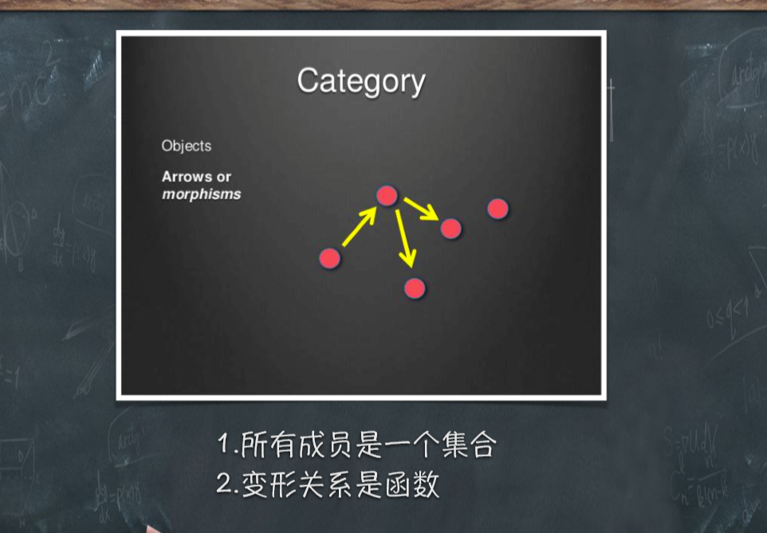

## JavaScript函数式编程(JavaScript Functional Programming)

## 函数式编程思维
    范畴论Category Theory
      1.函数式编程是范畴论的数学分支是一门很复杂的数学,认为世界上所有的概念体系都可以抽象出一个个范畴。
      2.彼此之间存在某种关系概念、事务、对象等等,都构成范畴。任何事物只要找出他们之间的关系,就能定义。
      3.箭头表示范畴成员之间的关系,正式的名称叫做"态射"(morohism)。范畴论认为,同一个范畴的所有成员,就是不同状态的"变形"(tranformation)。通过"态射",一个成员可以变形成另一个成员。

    
    函数式编程基础理论
      1.函数式编程(Functional Programming) 其实相对于计算机的历史而言是一个非常古老的模型,甚至早于第一台计算机的诞生。函数式编程的基础模型来源于λ(Lambda x=>x*2)演算,而λ演算并非设计于在计算机上执行,它是在20世纪三十年代引入的一套用于研究函数定义、函数应用和递归的形式系统
      2.函数式编程不是用函数来编程,也不是传统的面向过程编程。主旨在于将复杂的函数符合成简单的函数(计算理论,或者递归论,或者拉姆达演算)。运算过程尽量写成一系列嵌套的函数调用。
      3.JavaScript是披着C外衣的Lisp
      4.真正的火热是随着React的高阶函数而逐步升温。

      函数式编程不是用函数来编程！！！！！！

    其他
      1.函数是一等公民。所谓"第一等公民"(first class),指的是函数与其他数据类型一样,处于平等地位,可以赋值给其他变量,也可以作为参数,传入另一个函数,或者作为别的函数的返回值。
      2.不可改变变量。在函数式编程中,我们通常理解的变量在函数式编程中也被函数代替了:在函数式编程中变量仅仅代表某个表达式。这里所有的'变量'是不能被修改的。所有的变量只能被赋一次初值。
      3.map && reduce 他们是最常用的函数式编程的方法。
      
      1.函数是"一等公民"
      2.只用"表达式",不用"语句"
      3.没有副作用
      4.不修改状态
      5.引用透明
## 函数式编程常用核心概念
    纯函数
      对于相同的输入,永远会得到相同的输出,而且没有任何可观察的副作用,也不依赖外部环境的状态。

      var xs = [1,2,3,4,5];
      //Array.slice是纯函数,因为它没有副作用,对于固定的输入,输出总是固定的
      xs.slice(0, 3);
      xs.slice(0, 3);

      //不是纯函数
      xs.splice(0, 3);
      xs.splice(0, 3);
      
      import _ from 'lodash';
      var sin = _.memoize(x => Math.sin(x));
      //第一次计算的时候会稍慢一点
      var a = sin(7);
      //第二次有了缓存,速度极快
      var b = sin(7);
      纯函数不仅可以有效降低系统的复杂度,还有很多很棒的特性,比如可缓存性

      //不纯的
      var min = 18;
      var checkage = age => age > min;
      //纯的,这很函数式
      var  checkage = age => age > 18;
      在不纯的版本中,checkage不仅取决于age还有外部变量min。
      纯的checkage把关键字18硬编码在函数内部,扩展性比较差,柯里化优雅的函数式解决

      纯度和冥等性
        幂等性是指执行无数次后还具有相同的结果,同一的参数运行一次函应该与连续两次结果一致。幂等性在函数式编程中与纯度相关,但又不一致。
        Math.abs(Math.abs(-42))
        
    偏应用函数、函数的柯里化
      **偏应用函数
        传递给函数一部分参数来调用它,让它返回一个函数去处理剩下的函数
        偏函数之所以"偏",在就在其只能处理那些能与至少一个case语句匹配的输入,而不能处理所有可能的输入

        //带一个函数参数,和该函数的部分参数
        const partial = (f, ...args) => 
          (...moreArgs) => f(...args, ...moreArgs)
        const add3 = (a, b, c) => a +b +c
        //偏应用"2"和"3" 到"add3"给你一个单参数的函数
        const fivePlus = partial(add3, 2, 3)
        fivePlus(4)
        /***********************************/
        const partial = function(f, ...args) {
          return function(...moreArgs) {
            return f(...args, ...moreArgs);
          };
        };
        const add3 = function(a, b, c) {
          return a + b + c;
        };
        const fivePlus = partial(add3, 2, 3); // function(...m)
        fivePlus(4); //9
        /**********************************/

        //bind实现
        const add1More  = add3.bind(null, 2, 3)// (c) => 2 + 3 + c
      
      **函数的柯里化
        柯里化(Curried)通过偏应用函数实现
        传递给函数一部分参数来调用它,让它返回一个函数去处理剩下的参数。

        var checkage = min => (age => age > min);
        var checkage18 = checkage(18);
        checkage(20);

        Code
        //柯里化之前
        function(x, y) {
          return x + y;
        }
        add(1, 2)//3
        //柯里化之后
        function addX(y) {
          return function(x) {
            return x + y;
          }
        }
        addX(2)(1) //3

        import { curry } from 'lodash';

        var match = curry((reg, str) => str.match(reg));
        var filter = curry((f, arr) => arr.filter(f));
        var haveSpace = match(/\s+/g);
        //haveSpace("ffffffff");
        //haveSpace("ab");

        //filter(haveSpace, ["abcdefg", "Hello World"]);
        filter(haveSpace)(["abcdefg", "Hello World"]);
        事实上柯里化是一种"预加载"函数的方法,通过传递较少的参数,得到一个已经记住了这些参数的新函数,某种意义上讲,这是一种对参数的"缓存",是一种非常高效的编写函数的手法

    函数组合
      纯函数以及如何把它柯里化写出的洋葱代码h(g(f(x))),为了解决函数嵌套的问题,我们需要用到"函数组合";
      我们一起来用柯里化来改他,让多个函数像拼积木一样
      const compose = (f, g) => (x, f(g(x)));
      var first = arr => arr[0];
      var reverse = arr => arr.reverse();
      var last = compose(first, reverse);
      last([1, 2, 3, 4, 5]);。

    Point Free
      把一些对象自带的方法转化成纯函数,不要命名转瞬即逝的中间变量
      这个函数中,我们使用了str作为我们的中间变量,但这个中间变量除了让代码变得长了一点以为是毫无意义的。
      const f = str => str.toUpperCase().split('');
      优缺点
        var toUpperCase = word => word.toUpperCase();
        var split = x => (str => str.split(x));

        var f = compose(split(''), toUpperCase);
        f("abcd efgh);
        这种风格能够帮助我们减少不必要的命名,让代码保持简洁和通用

    声明式与命令式代码
      命令式代码的意思就是,我们通过编写一条又一条指令去让计算机执行一些动作,这其中一般都会涉及到很多繁杂的细节。而声明式就要优雅很多了, 我们通过写表达式的方式来声明我们想干什么, 而不是一步一步的指示。

      //命令式
      let CEOs  = [];
      for(var i=0; i< companies.length; i++) {
        CEOs.push(companies[i].CEO);
      }
      //声明式
      let CEOs = companies.map(c => c.CEO);

      优缺点
        函数式编程的一个明显的好处就是这种声明式的代码, 对于无副作用的纯函数, 我们完全可以不用考虑函数内部是如何实现的, 专注于编写业务代码。优化代码时, 目光只需要集中在这些稳定坚固的函数内部即可。
        相反, 不纯的函数式的代码会产生副作用或者依赖外部系统环境,使用它们的时候要考虑这些不干胶的副作用。在复杂的系统中,这对于程序员的心智来说是极大的负担。

    惰性求值、惰性函数、惰性链
      在指令式语言中以下代码会按顺序执行, 由于每个函数都有可能改动或者依赖于其外部的状态, 因此必须顺序执行。

      function someWhatLongOperation1(){someWhatLongOperation1};
      new LazyChain([2,1,3]);

    更加专业术语
      高阶函数
        函数当参数，把传入的函数做一个封装，然后返回这个封装函数，达到更高程度的抽象。

        //命令式
        vca add = function(a, b) {
          return a + b;
        };
        function math(func, array) {
          return func(array[0], array[1]);
        };
        math(add, [1,2]);
        /*******************/
        它是一等公民
        它以一个函数作为参数
        以一个函数作为返回结果

      尾调用优化PTC
        指函数内部的最后一个动作是函数调用。该调用的返回值,直接返回给函数。函数调用自身,称为递归。如果尾调用自身,就称为尾递归。递归需要保存大量的调用记录，很容易发生栈溢出错误,如果使用尾递归优化，将递归变为循环，那么只需要保存一个调用记录,这样就不会发生栈溢出错误了。
        //不是尾递归，无法优化 斐波拉契数列
        function factorial(n) {
          if (n === 1) return 1;
          return n * functional(n - 1);
        }
        function factorial(n, total) {
          if (n === 1) return total;
          return functional(n - 1, n*total);
        } //ES6强制使用尾递归

        尾递归的问题
          1.尾递归的判断标准是函数运行【最后一步】是否调用自身，而不是是否在函数的【最后一行】调用自身，最后一行调用其他函数并返回叫尾调用。
          2.按道理尾递归调用调用栈永远都是更新当前的栈帧而已，这样就完全避免了爆栈的危险。但是现如今的浏览器并未完全支持原因有二:
            ①在引擎层面消除递归是一个隐士的行为,程序员意识不到。
            ②栈堆信息丢失了 开发者难调试。
          3. 既然浏览器不支持我们可以把这些递归写成while~

      闭包
        function makePowerFn(power) {
          function powerFn(base) {
            return Math.pow(base, power);
          };
          return powerFn;
        }
        var square = makePowerFn(2);
        square(3);//9
        /****了解栈、堆****/
        虽然外层的makePowerFn函数执行完毕,栈上的调用帧被释放,但是堆上的作用域并不被释放,因此power依旧可以被powerFn访问,这样就形成了闭包。

      /**********正式开始****************/
      范畴和容器
        1.我们可以把"范畴"想象成是一个容器,里面包含两样东西。值(value)、值的变形关系,也就是函数。
        2.范畴论使用函数,表达范畴之间的关系。
        3.伴随着范畴论的发展,就发展处一整套函数的运算方法。这套方法只用于数学运算,后来有人将它在计算机上实现了,就变成了今天的"函数是编程"。
        4.本质上,函数式编程知识范畴论的运算方法,跟数学逻辑、微积分、行列式是同一类东西,都是同一类方法,知识碰巧它能用来写程序。为什么函数式编程要求函数必须是纯的,不能有副作用?因为它是一种数学运算,原始目的就是求值,不做其他事情,否则就无法满足函数的运算法则了。

        *函数不仅可以用于同一个范畴之中值的转换,还可以用于将一个范畴转成另一个范畴.这就涉及到了函子(Functor)
        *函子是函数式编程里面最重要的数据类型,也是基本的运算单位和功能单位。它首先是一种范畴,也就是说,是一个容器,包含了值和变形关系。比较特殊的是,它的变形关系可以依次作用域每一个值,将当前容器变形成另一个容器。

      容器、Functor(函子)
        $(...) 返回的对象并不是一个原生的 DOM 对象，而是对于原生对象的一种封装，这在某种意义上就是一个“容器”(但它并不函数式)。

        Functor（函子）遵守一些特定规则的容器类型。任何具有map方法的数据结构，都可以当作函子的实现。
        Functor 是一个对于函数调用的抽象，我们赋予容器自己去调用函数的能力。把东西装进一个容器，只留出一个接口 map 给容器外的函数，map 一个函数时，我们让容器自己来运行这个函数，这样容器就可以自由地选择何时何地如何操作这个函数，以致于拥有惰性求值、错误处理、异步调用等等非常牛掰的特性。

        代码实现：
        var Container = function(x) {
          this._value = x;
        };
        //函数式编程一般约定,函子有一个of方法
        Container.of = x => new Container(x);
        //Container.of('abcd');
        //一般约定,函子的标志就是容器具有map方法。该方法将容器里面的每一个值,映射到另一个容器。
        Container.prototype.map = function(f) {
          return Container.of(f(this._value));
        };
        Container.of(3)
          .map(x => x + 1)       //结果Container(4)
          .map( x => 'Result is ' + x );  //结果Container('Result is 4')

        map:
          class Functor {
            constructor(val) {
              this.val = val;
            }

            map(f) {
              return new Functor(f(this.val));
            }
          }
          (new Functor(2)).map(function(two) {
            return two + 2;
          })
          //Functor(4);
          上面代码中，Functor是一个函子,它的map方法接受函数f作为参数,然后返回一个新的函子,里面包含的值是被f处理过的(f(this.val))

          一般约定,函子的标志就是容器具有map方法.该方法将容器里面的每一个值,映射到另一个容器。上面的例子说明,函数式编程里面的运算，都是通过函子完成,即运算不直接针对值，而是针对这个值的容器----函子。函子本身具有对外接口(map方法),各种函数就是运算符,通过接口接入容器,引发容器里面的值的变形

          因此,学习函数式编程,实际上就是学习函子的各种运算。由于可以把运算方法封装在函子里面,所以又衍生出各种不同类型的函子,有多少种运算,就有多少种函子。函数式编程就变成了运用不同的函子,解决实际问题。

        of方法
          你可能注意到了,上面生成的新的函子的时候,用了new命令。这实在太不像函数式编程了,因为new命令是面向对象编程的标志。
          函数式编程一半约定,函子有一个of方法,用来生成新的容器。  
          Functor.of = function(val) {
            return new Functor(val);
          };

          Functor.of(2).map(function(val) {
            return two + 2;
          });
          Functor(4);

      Maybe函子
        函子接受各种函数,处理容器内部的值。这里就有一个问题,容器内部的值可能是一个空值(比如null),而外部函数未必有处理空值的机制,如果传入空值,很可能就会出错。
        Functor.of(null).map(function(s) {
          return s.toUpperCase();
        });
        //TypeError
        class Maybe extends Functor {
          map(f) {
            return this.val ? Maybe.of(f(this.val)) : Maybe.of(null);
          }
        }
        Maybe.of(null).map(function(s) {
          return s.toUpperCase();
        })
        //Maybe(null)
        var Maybe = function(x) {
          this.__value = x;
        }
        Maybe.of = function(x) {
          return new Maybe(x);
        }
        Maybe.prototype.map = function(f) {
          return this.isNothing() ? Maybe.of(null) : Maybe.of(f(this.__value));
        }
        Maybe.prototype.isNothing = function() {
          return (this.__value === null || this.__value === undefined);
        }
        //新的容器我们称之为Maybe

      错误处理、Either、AP
        1.我们的容器能做的事情太少了, try/catch/throw并不是"纯"的,因为它从外部接管了我们的函数,并且在这个函数出错时抛弃了它的返回值
        2.Promise是可以调用catch来集中处理错误的
        3.事实上Either并不是只是用来做错误处理的,它表示了逻辑或、范畴学里的coproduc
      
      Either
        条件运算if...else是最常见的运算之一,函数式编程里面,使用Either函子表达。Either函子内部有两个值:左值(left)和右值(Right)。右值是正常情况下使用的值,左值是右值不存在时使用的默认值。
      
      AP因子
        1. 函子里面包含的值,完全可能是函数。我们可以想象这样一种情况，一个函子的值是数值,另一个函子的值是函数。
          class Ap extends Functor{
            ap(F) {
              return Ap.of(this.val(F.val))
            }
          }
          Ap.of(addTwo).ap(Functor.of(2))

      IO
        1.真正的程序总要去接触肮脏的世界
          function readLocalStorage() {
            return window.localStorage;
          }
        2.IO跟前面那几个Functor不同的地方在于,它的_value是一个函数。它把不纯的操作(比如IO、网络请求、DOM)包裹到一个函数内,从而延迟这个操作的执行
        3.IO其实也算惰性求值
        4.IO负责了调用链积累了很多很多不纯的操作,带来的复杂性和不可维护行。

      Monad
        1.Monad就是一种设计模式,表示将一个运算过程,通过函数拆解成互相连接的多个步骤。你只要提供下一个运算的函数,整个运算就会自动进行下去。
        2.Promise就是一种Monad
        3.Monad让我们避开了嵌套地狱,可以轻松的进行深度嵌套的函数式编程,比如IO和其他异步任务
        4.记得让上面的IO继承Monad
## 当下函数式编程最热的库
    RxJS
      RxJS 从诞生以来一直都不温不火，但它函数响应式编程(Functional Reactive Projramming, FRP)的理念非常先进
      在RxJS中,所有的外部输入(用户输入、网络请求等)都被视作一种【事件流】
      var clicks = Rx.Observable
      .formEvent(document, 'click)
      .bufferCount(2)
      .subscribe(x => console.log(x));//打印出前2次点击事件

      用户点击了按钮 --> 网络请求成功 --> 用户键盘输入 --> 某个定时事件发生 这种事件特别适合处理游戏

      响应式编程是继承自函数式编程,声明式的,不可变的,没有副作用的是函数式编程的三大护法。其中不可变武功最高深。一直使用面向对象范式编程的我们,习惯了用变量存储和追踪程序的状态。RxJS从函数式编程范式中借鉴了很多东西,比如链式函数调用,惰性求值等。

      在函数中与函数作用域之外的一切事物有交互的就产生了副作用。比如读写文件,在控制台打印语句,修改页面元素的css等等。在RxJS中,把副作用的问题推给了订阅者来解决
    
    cycleJS
      Cycle.js是一个基于RxJS的框架,它是一个彻彻底底的FRP理念的框架,和React一样支持virtual DOM、JSX语法,但现在似乎还没有看到大型的应用经验。

    lodashJS、lazy(惰性求值)
      loda是一个具有一致接口、模块化、高性能等特性的JavaScript工具库。
    underscoreJS
      是一个JavaScript工具库,它提供了一整套函数式编程的实用功能。

    ramdajs

## 函数式编程的实际应用场景

    易调试、热部署、并发

    单元测试

    总结与补充
        函数式编程不应被视为灵丹妙药。相反,它应该被视为我们现有工具箱的一个很自然的补充——它带来了更高的可组合性,灵活性,以及容错性。现代的JavaScript库已经开始尝试拥抱函数式编程的概念以获取这些优势。Redux作为一种FLUX的变种实现,核心理念也是状态机和函数式编程。

        本节课介绍了纯函数、柯里化、PointFree、声明式代码和命令式代码的区别,只要记住【函数对于外部状态的依赖是造成系统复杂性大大提高的主要原因】以及【让函数尽可能的纯净】就行了。
        然后介绍了【容器】的概念和Maybe、Either、IO这三个强大的Functor。
        如果说OOP降低复杂度是靠良好的封装、继承、多态以及接口定义的话,那么函数式编程就是通过纯函数以及它们的组合、柯里化、Functor等技术降低系统复杂度,而React、RxJS、Cycle.js正是这种理念的代言。