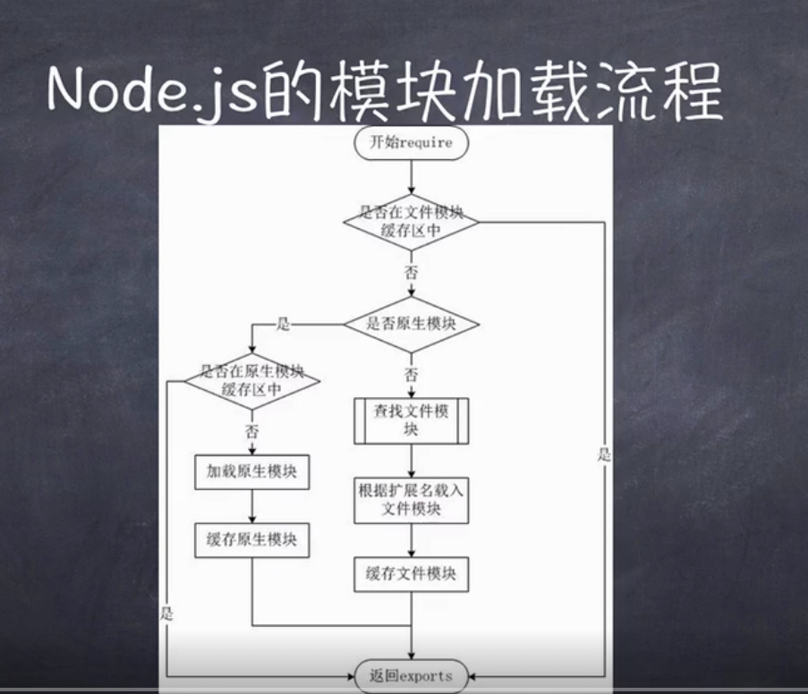

# NodeJS基础API

## 走进NodeJS
    1.什么是Node.js
        ※Node.js的本质是一个JavaScript的解析器
        ※Node.js是JavaScript的运行环境
        ※Node.js是一个服务器程序
        ※Node.js本身使用的V8引擎
        ※Node.js不是Web服务器

    2.为什么要用Node.js
        ※为了提供高性能的Web服务
        ※IO性能强大
        ※事件处理机制完善
        ※天然能够处理DOM
        ※社区非常活跃,生态圈日趋完善

    3.Node.js的优势在哪里
        ※处理大流量数据
        ※适合实时交互的应用
        ※完美支持对象数据库  mongodb
        ※异步处理大量并发连接
            一台服务器同时有很多连接访问

    4.学习Node.js的前置知识
        ※JavaScript
        ※ES6
        ※一些服务器相关的知识
        ※最好在Linux系统下进行开发

    5.相关资源和学习资料
      官方网站
        https://nodejs.org/en/
        http://nodejs.cn/
      中文社区
      手册
      开源代码

## NodeJS入门
        安装NodeJS
        包管理器NPM
        Hello Word
        写一个最简单的Web服务器应用

        var http = require('http');

        http.createServer(function (req, res) {
        //定义HTTP头
        res.writeHead(200, {
            'Content-type': 'text/plan'
        });
        //发送相应的数据
        res.end('Hello World!\n');
        }).listen(8001);
        //服务运行后输出一行信息
        console.log('server is running...');

## NodeJS环境及NPM命令深入

    1.NodeJS REPL环境
    2.包管理器NPM详解
        本地安装和全局安装

        npm的使用方法

        npm常用命令

## NodeJS回调函数
    
    1. 什么是回调 
        函数调用方式分为三类: 同步调用、回调和异步调用
        回调是一种双向调用模式
        可以通过回调函数来实现回调

    2.阻塞和非阻塞
        阻塞和非阻塞关注的是程序在等待调用的结果(消息、返回值)时的状态
        阻塞就是做不完不准回来
        非阻塞就是你先做,我先看看有其他事没有,完了告诉我一声

    3.NodeJS的回调函数
        //阻塞时代码
        /* var fs = require('fs');
        var data = fs.readFileSync('data.txt');
        console.log(data.toString()); */

        //非阻塞代码
        var fs = require('fs');
        fs.readFile('data.txt', function(err, data) {
        if(err) {
            return console.log(err);
        }
        console.log(data.toString());
        });
        console.log('程序执行完毕！');

## NodeJS事件驱动机制

    1.事件驱动模型

    2.事件与事件绑定
        引入events对象,创建eventEmitter对象
        绑定事件处理程序
        触发事件

        //引入Event模块并创建eventsEmitter对象
        var events = require('events');
        var eventEmitter = new events.EventEmitter();
        //绑定事件处理函数
        var connctHandler = function connected() {
        console.log('connected被调用！');
        }
        eventEmitter.on('connection', connctHandler); //完成事件绑定
        //触发事件
        eventEmitter.emit('connection');
        console.log('程序执行完毕');

## NodeJS模块化

    1.模块化的概念和意义
        ※为了让NodeJS的文件可以相互调用,NodeJS提供了一个简单的模块系统
        ※模块时NodeJS应用程序的基本组成部分
        ※文件和模块时一一对应的。一个NodeJS文件就是一个模块
        ※这个文件可能时JavaScript代码、JSON或者编译过的C/C++扩展
        ※NodeJS中存在4类模块(原声模块和3中文件模块)

    2.NodeJS中的模块
        模块加载方式
            从文件模块缓存中加载
            从原生模块加载
            从文件加载
        
        require方法加载模块
            require方法接受以下几种参数的传递:
                http、fs、path等,原生模块
                ./mod或../mod,相对路径的文件模块
                /pathtomodule/mod,绝对路径的文件模块
                mod,非原生模块的文件模块
    3.NodeJS的模块加载流程

    4.模块化代码案例
        hello.js
        //模块的主要逻辑
        function Hello() {
        var name;
        this.setName = function(argName) {
            name = argName;
        }
        this.sayHello = function() {
            console.log('Hello' + name);
        }
        }
        //对模块进行导出
        module.exports = Hello;

        main.js
        //调用Hello模块
        var Hello = require('./hello');
        hello = new Hello();
        hello.setName('Yideng');
        hello.sayHello();

## NodeJS函数
        函数概念
        匿名函数
        HTTP服务器端的函数传递
        //同样的功能 ,不同的实现方式
        //匿名函数
        var http = require('http');
        http.createServer(function(request, response) {
        response.writeHead(200, {'Content-type': 'text/plan'});
        response.write('Hello World');
        response.end();
        }).listen(8888);

        //先定义后传递
        var http = require('http');
        function onRequest(request, response) {
        response.writeHead(200, {'Content-type': 'text/plan'});
        response.write('Hello World');
        response.end();
        };
        http.createServer(onRequest).listen(8888);

## NodeJS路由
        function route(pathname, response) {
        if (pathname == '/') {
            response.writeHead(200, {
            'Content-type': 'text/plain'
            });
            response.write('Hello World');
            response.end();
        } else if (pathname == '/index/home') {
            response.end('index');
        } else {
            response.end('404');
        }
        }
        exports.route = route;

## NodeJS全局对象
        process
        它用于描述当前NodeJS进程状态的对象

        exit
        beforeExit
        uncaughtException
        Signal

        NodeJS常用工具
            util 是一个Node.js 核心模块，提供常用函数的集合，用于弥补核心JavaScript 的功能 过于精简的不足
            
            underscore.js

## NodeJS文件系统