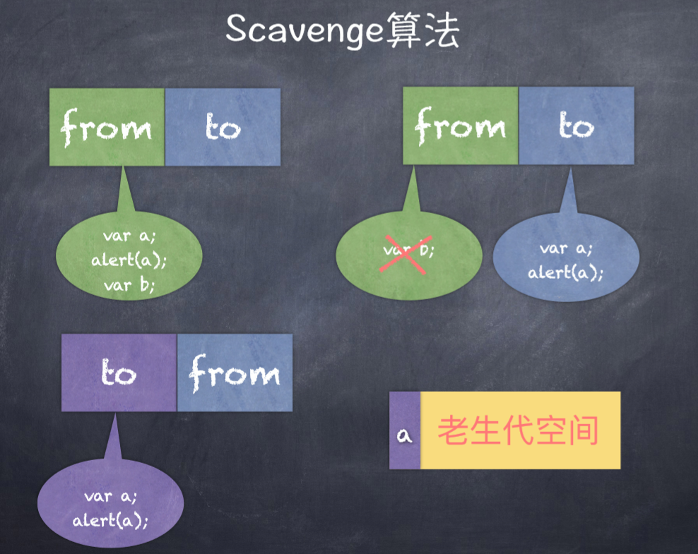
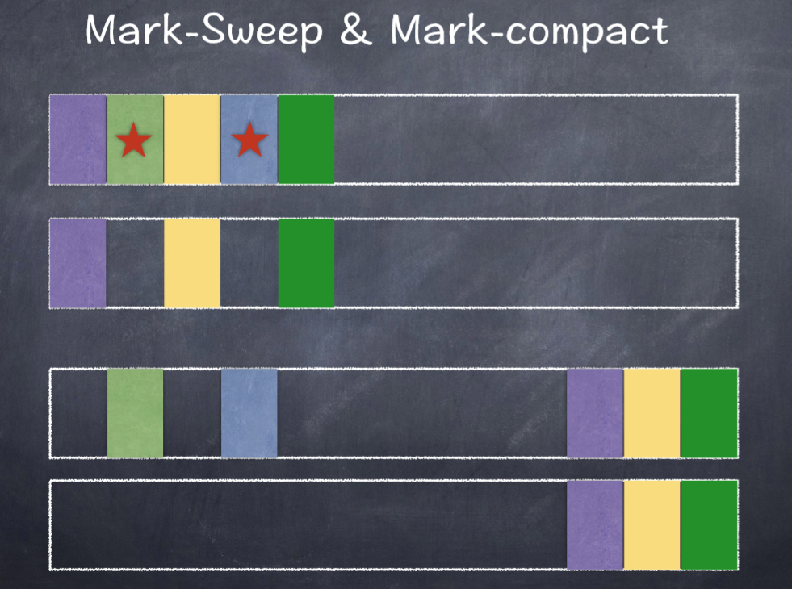
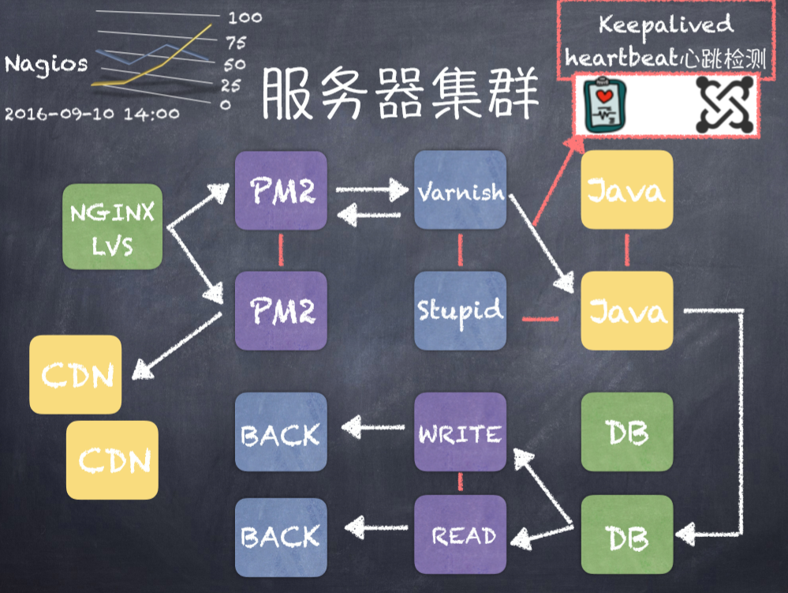

#大规模NodeJS项目架构与优化

    1 node proxy 代理  前后端分离 控制路由
    2 vue 同构化 SSR  three.js FMP FCP
    3 proxy代理  删除没用的api
    4 跨端
    5 游戏

    Reaktor Hello Word

## NodeJs异步IO原理浅析及优化方案
    异步IO的是与非
      1.前端通过异步IO可以消除UI堵塞
      2请求资源A的时间M,请求资源B的时间为N,那么同步的请求耗时为M+N,异步方式为Max(M,N)
      3.随着业务的复杂,会引入分布式系统,时间会线性增加
      4.I/O是昂贵的,分布式IO更是昂贵的
        CPU时钟周期 1/CPU主频
      5. NodeJS适用于IO密集型不适用CPU密集型

    Node对异步IO的实现
      完美的异步IO应该是应用程序发起非阻塞调用,无需通过遍历或者事件循环等方式轮询、
      不占用系统的文件描述符,直接进入系统应用

    几个特殊的API
      1.SetTimeout和SetInterval 线程池不参与
      2.process.nextTick() 实现类似
        setTimeout(function{},o);每次调用放入对列中,
        在下一轮循环中取出
      3.setlmmediate() 比process.nextTick() 优先级低
      4.Node如何实现一个Sleep?

        setTimeout(function() {
          console.log(1);
        },0);
        setlmmediate(function() {
          console.log(2)
        });
        process.nextTick(() => {
          console.log(3)
        });
        new Promise((reslove, reject) => {
          console.log(4);
          reslove(4);
        }).then(function(){
          console.log(5);
        })
        console.log(6)
        4 6 3 5 1 2
        同步 > (异步队列优先) > nextTick > Promise
        LIBUV不管它们

        async function test() {
          console.log('Hello')
          await sleep(1000)
          console.log('world')
        }
        function sleep(ms) {
          return new Promise(reslove => setTimeout(reslove,ms))
        }
        test()

    函数式编程在Node中的应用
      高阶函数:可以将函数作为输入或者返回值
      偏函数 指定部分参数产生一个新的定制函数的形式

    常用的Nodek控制异步API的技术手段
        1.Ste、wind(提供等待异步库)、Bigpipe、 Q.js
        2.Async、Await
        3.Promise/Defferred是一种先执行同步调用,延迟传递的处理方式。Promise是高级接口,事件是低级接口。低级接口可以构建更多复杂的场景,高级接口一旦定义,不太容易变化,不再有低级接口的灵活性,但对于解决问题非常有效
        4.由于node基于V8的原因,目前还不支持协程。协程不是进程或线程,其执行过程更类似于子例程,或者不带返回值的函数调用
        5.y一个程序可以包含多个协程,可以对比与一个进程包含斗个线程

## NodeJS内存管理机制及内存优化
      V8垃圾回收机制
      Node使用Javascript在服务端操作大内存d对象受到了一定的限制(堆区)
      V8的l垃圾回收策略主要基于分代式垃圾回收机制。在自动垃圾回收的演变过程中,人们发现没有一种垃圾回收机制算法能够胜任所有场景。V8中内存分为新生代和老生代两代。新生代为存活时间较短的对象,老生代中为存活时间较长的对象
      一句话表示:小孩子尽管玩,到处丢东西大人收

      Scavenge算法
      新生代  新的代码和变量
      from  新的变量(a,b)  没有用到的变量留在from里面  b
      to  用到的变量 a 
      调换位置 继续回收
      to   a
      from 
      a  老生代空间

      将内存一分为二,一个处于使用,一个处于闲置
      处于使用的称之为From 闲置的称之为To
      分配对象时先分配到From,当开始进行垃圾回收时,检查From存活对象复制到To,非存活被释放。然后互换位置,再次进行回收,发现被回收直接晋升,或者发现To空间已经使用了超过25%

      老生代
      Mark-Sweep
      标记清除

      常见内存泄漏的问题
        无限制增长的数组
        无限制设置属性和值
        任何模块内的私有变量和方法均是永驻内存的 a = null
        大循环 无GC机会

## 大规模Node站点结构原理分析
    MVC
## 服务器集群管理与Node集群的应用
    预备上线
    1、前端工程化的搭载动态文件的MAP分析压缩打包合并至cdn
    2、单侧、压测性能分析工具发现BUG
    3、编写nginx-config实现负载均衡和反向代理
    4.PM2启动应用程序小流量灰度上线,修复BUG

    多线程
    PM2 是一个带有负载均衡功能的Node应用的进程管理器

    服务器集群

## UV过千万的Node站点真身