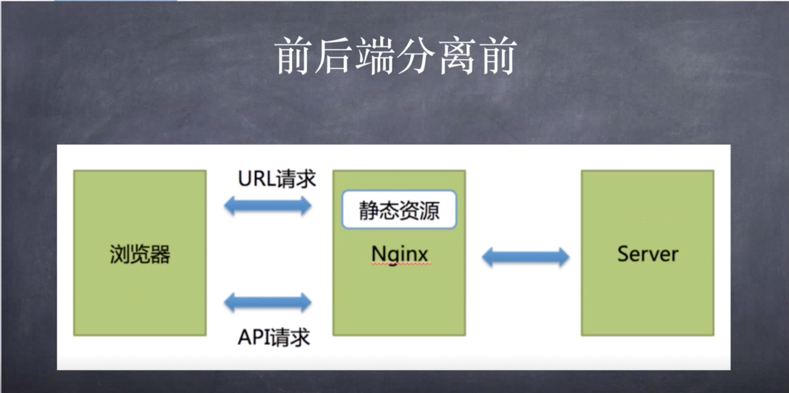
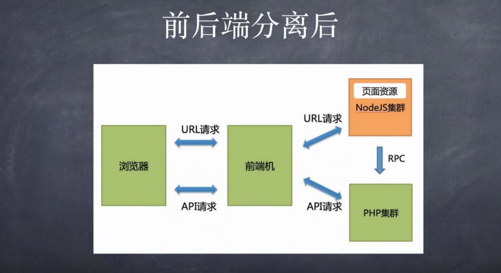
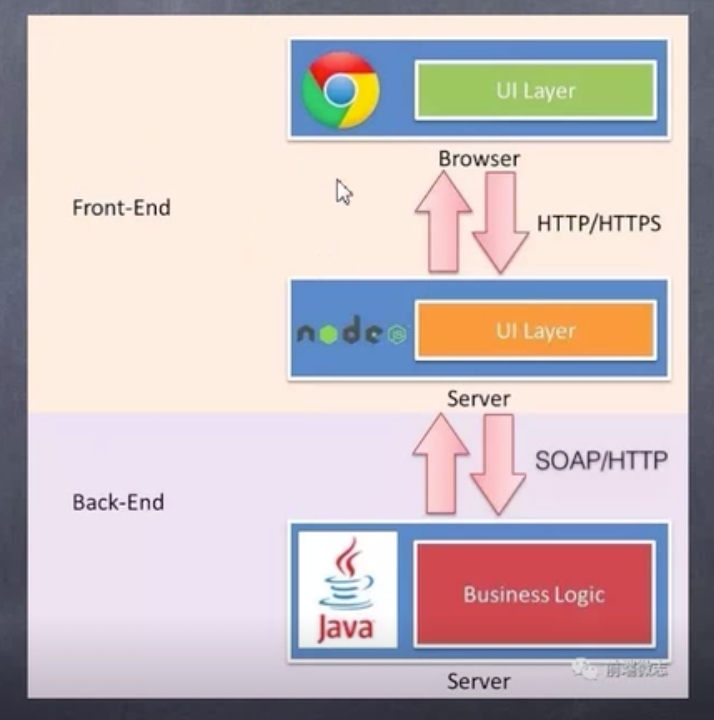
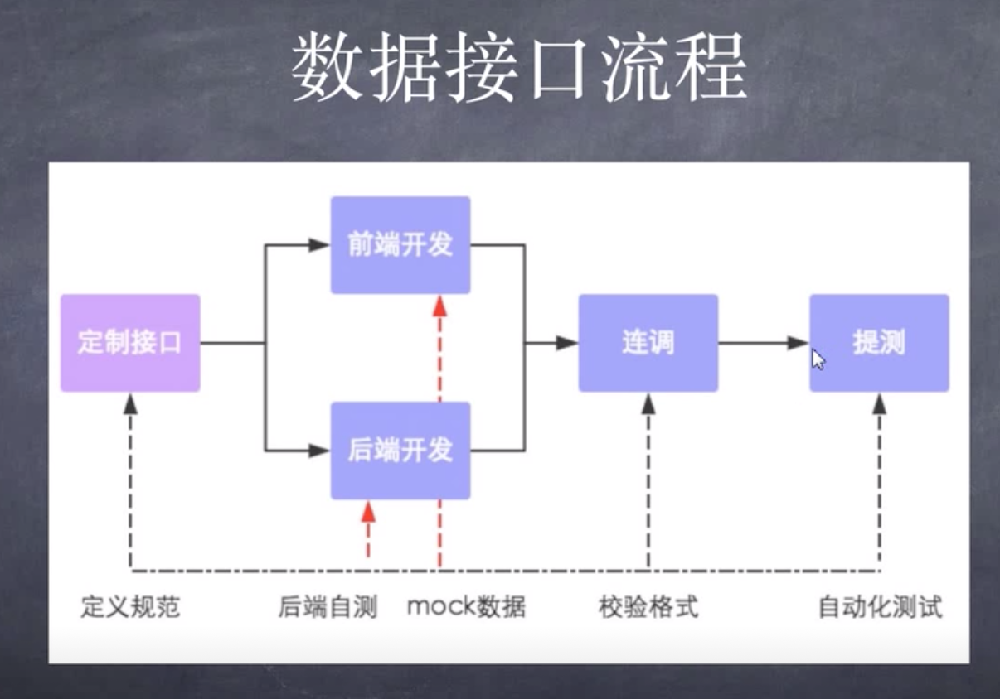

# 走进后端工程师的世界

## 一、前端与后端
    Front-End  Back-End
    1.前端程序员为什么要懂点后端
      (1)对系统来讲前后端都不是孤立的
      (2)前后端的合作很重要
      (3)想做全栈不明白后端就是个笑话
      (4)与后端程序员互怼的时候占优势

    用户可以看到的属于前端
    其他都属于后端范畴

    2.网络系统的演进史
      前后端未分离：前后端代码冗杂在一起
      前后端半分离：前后端代码分离，部署未分离
      前后端分离：前后端代码分离，部署分离 

    3.前端与大前端
    
      大前端的语言和技术
      ES5&ES6&ES7 //ES语言基础
      HTML5 & CSS3 //HTML和CSS特效
      Less & Sass //CSS预编译语言
      SVG & Canvas & D3.js //图形数据可视化
      WebGL & Thress.js //3D场景
      CMD & AMD & CommonJS //语言标准
      RequireJS & SeaJS //ES模块化库
      CoffeeScript & TypeScript //ES语言风格库
      NodeJS & Express & Koa //Node的WEB服务器

      哪些情况需要前后端分离
        页面布局复杂,使用了主题和样式
        需要有较高的页面渲染效果
        前端页面中包含复杂业务逻辑
        页面需要渲染的数据量较大

      典型应用场景
        H5游戏
        Native开发的移动APP
        浏览器插件
        微信小程序
        Electron开发的桌面应用
        各类大型网站
        ......
    4.后端都有啥
    5.前后端分离的意义
        前后端各司其职,工作各有分工
        提高开发效率
        完美应对前端需求的变化
        增强代码的可维护性
## 二、前后端分离的那些套路
    1.前后端分离流行技术方案
      前后端分离之前  

      前后端分离之后

        大前端范畴 nodejs集群 ->RPC(一种网络通信协议)-> PHP集群 

      nodejs架构分层方案

   
    前后端交互形式
      更多的是采用RESTful风格的接口
      REST是"呈现状态转移(REpresentational State Transfer)"的缩写,一种API的架构风格,在客户端和服务端之间通过呈现状态的转移来驱动应用状态的演进.
      RESTful简介
        使用GET、POST、PUT、DELETE这几种请求模式
        1.get(select) 从服务器抽取资源
        2.post(cteate) 在服务器创建一个资源
        3.put(updata) 在服务器更新资源
        4.delete(delete) 从服务器删除资源   
    2.前后端通信手段
    3.联合调试的那些坑

    数据接口流程

    坑在联调部分
## 三、讲给前端程序员的后端套路
